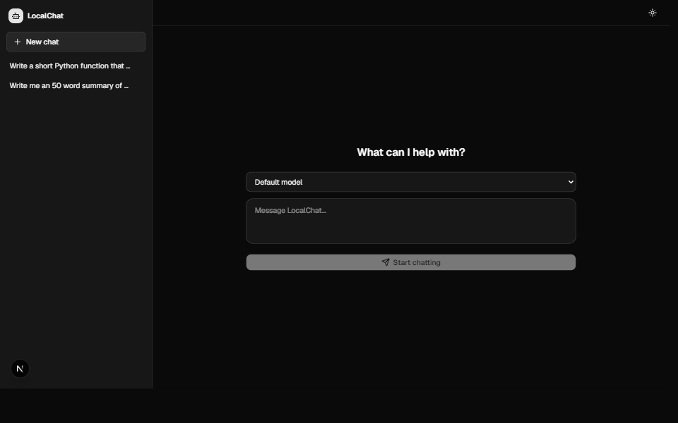
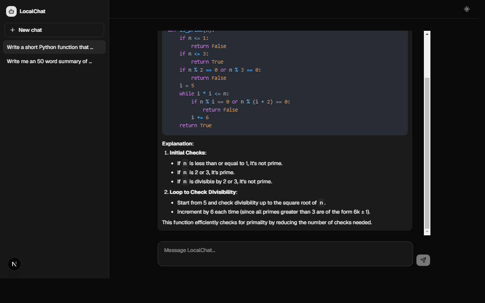
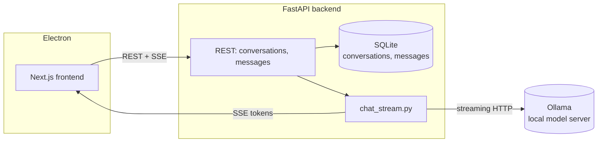

# localchat-ai

A ChatGPT-like desktop chat app running entirely against a self-hosted local model — no
Anthropic/OpenAI API key, no per-token cost, no data leaving the machine.

5th project in a 2026 portfolio series — see [docuchat-ai](https://github.com/rlphjyson/docuchat-ai)
(RAG chat), [prreview-ai](https://github.com/rlphjyson/prreview-ai) (AI PR review),
[mcp-toolkit-ai](https://github.com/rlphjyson/mcp-toolkit-ai) (5 MCP servers + CLI), and
[agent-ops-dashboard](https://github.com/rlphjyson/agent-ops-dashboard) (multi-agent fleet
dashboard). Deliberately standalone — no integration with the other four repos.

## Why a separate project instead of another Claude-powered app

Every prior project in this series calls a paid Claude API or CLI. This one asks the opposite
question: how far does a fully self-hosted, quantized open model get you for everyday chat and
coding questions, running on consumer hardware (an RTX 3060), with zero ongoing cost? [Ollama](https://ollama.com)
does the actual model serving; this project is the app built around it — persistence, streaming,
a real Stop button, and a desktop shell.

## Screenshots

| New chat | A real conversation |
| --- | --- |
|  |  |

## Architecture



### Request flow

1. **Start a conversation** — `POST /conversations` creates a row (pinned to whichever model was
   picked, or the configured default) and returns immediately.
2. **Send a message** — `POST /conversations/{id}/messages` persists the user's message, builds
   the full prior history + a system prompt, and opens a streaming request to Ollama's native
   `/api/chat` endpoint.
3. **Stream back** — each token Ollama produces is relayed to the browser as an SSE `token` event
   as it arrives; a final `done` event carries Ollama's own tokens/sec stat.
4. **Persist** — once the stream ends (naturally, on error, or because the user hit Stop), the
   complete — or partial — assistant reply is saved, so a stopped generation is never silently
   lost.

## A real bug worth calling out

Checking `request.is_disconnected()` between chunks isn't enough on its own to handle a client
clicking Stop. When the browser aborts the fetch, the ASGI server cancels the streaming
generator's task outright — the cancellation raises *inside* the loop, which isn't an
`httpx.HTTPError`, so persistence code placed after the loop never ran. A live test confirmed it:
stopping a generation left only the user's message saved, the assistant's real partial reply
silently dropped. Fixed by moving persistence into a `finally` block, so it runs no matter how
the generator exits.

## Tech stack

| Layer | Choice | Why |
| --- | --- | --- |
| Model serving | [Ollama](https://ollama.com) | Simplest reliable way to run a quantized GGUF model locally on Windows, with a clean REST API and per-model tool-calling/context metadata already worked out. |
| Model | Qwen2.5-Coder-7B-Instruct (default) | Strong at both general chat and code for its size; comfortably fits an RTX 3060's VRAM quantized (Q4_K_M, ~4.7GB). Swappable per-conversation — see below. |
| Backend | FastAPI + SQLModel | Same pattern as the rest of the series. |
| Streaming | Server-Sent Events over a plain `fetch()` | No auth, single active generation per conversation — simpler than the WebSocket relay agent-ops-dashboard needed for its multi-run fleet view. |
| Frontend | Next.js App Router + TS + Tailwind + shadcn | Matches the series. Markdown + syntax-highlighted code blocks via `react-markdown`/`react-syntax-highlighter`. |
| Desktop | Electron | Wrapper ported directly from agent-ops-dashboard's already-debugged pattern (health-poll both services, `taskkill /T /F` teardown). |
| Auth | None | Single-user local app — the JWT layer every hosted project in this series needed is deliberately not here. |

## Getting started

### 1. Install Ollama and pull a model

[Install Ollama](https://ollama.com/download) for your platform, then:

```bash
ollama pull qwen2.5-coder:7b
```

Any model you pull shows up automatically in the app's model picker — no code changes needed.
Some other models worth trying on similar hardware: `llama3.1:8b` (general chat, tool-calling),
`deepseek-r1:8b` (visible chain-of-thought reasoning), `llama3.2:3b` (fast/lightweight).

By default Ollama stores models under your user profile. To use a different drive (e.g. if `C:`
is short on space), set `OLLAMA_MODELS` to another directory before pulling.

### 2. Backend

```bash
cd backend
python -m venv .venv && .venv/Scripts/activate   # or source .venv/bin/activate
pip install -e ".[dev]"
uvicorn app.main:app --reload --port 8000
```

### 3. Frontend

```bash
cd frontend
npm install
npm run dev
```

### 4. Desktop app (optional)

Wraps the same backend/frontend above in a real window instead of two terminals and a browser
tab:

```bash
cd desktop
npm install
npm start
```

## Testing

- Every backend test goes through the `OllamaClient` Protocol seam — `FakeOllamaClient` yields
  canned chunks for the conversation/message endpoints, and `RealOllamaClient`'s own request/
  parsing logic is unit-tested directly against `httpx.MockTransport`. No CI job needs a real
  Ollama instance.
- A dedicated regression test (`test_chat_stream.py`) simulates the generator being closed
  abruptly mid-stream (matching what a real client disconnect does) and asserts the partial
  reply still gets persisted — the exact bug described above.
- Frontend: Vitest + Testing Library, including a hand-rolled SSE stream (a real `ReadableStream`
  feeding hand-written frames) driving `useChatStream` through token accumulation, an error
  event, and an aborted (Stop) request, without needing a real backend.
- 62 tests total (22 backend, 20 frontend), all green, ruff/mypy/eslint/tsc/build clean on both
  sides.
- Live-verified manually against a real Ollama instance: streaming responses, multi-turn context
  retention across turns, conversation delete, and the Stop-mid-stream fix above.

## Production notes

This is built for local, single-user use, not a hosted deployment:

- **No auth.** Anyone with access to the machine (or the port, if exposed) can use it.
- **Single active generation assumed per conversation.** No queueing or concurrency control if
  multiple requests hit the same conversation at once.
- **Model quality is a real tradeoff.** A quantized 7-8B local model is not Claude — it's a
  genuinely different point on the cost/quality curve, not a drop-in replacement for the other
  projects in this series (which is why this one is intentionally standalone).

## License

[MIT](LICENSE)
